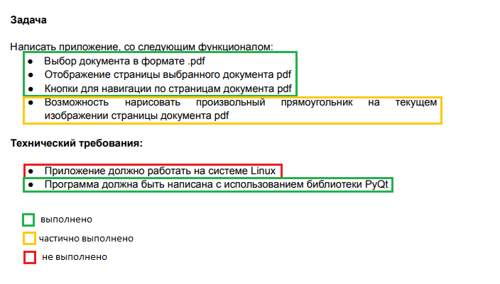

# PDF Viewer
### Тестовое задание для NVI Solutions.

## О файлах

- **tmp/**: каталог хранения страниц на время просмотра документа
- **design.ui**: модель приложения
- **design.py**: сгенерированный код модели приложения
- **main.py**: сам код приложения
- **nvi_test.deb**: DEB-пакет приложения
- **requirements.txt**: библиотеки приложения
- **test.pdf**: тестовый PDF-файл

## О прогрессе

На данный момент есть несколько недоработок в программе:

- Отрисовка прямоугольника происходит после того, как отпустишь кнопку мышь.
- - (планирую в процессе движения курсора)
- Прямоугольник появляется не там, где рисуешь, а со смещением.
- Страница появляется а обрезанном виде, если отличается по формату от заданных размеров.
- - (видимо по из-за этого и возникает проблема с отрисовкой прямоугольника в неправильном месте)
- Собранный deb-пакет устанавливается корректно, но при попытке загрузить файл программа закрывается.
- - (тестировал на своей машине с Ubuntu 22.04 c графической оболочкой Gnome)

Также возможны различные непредвиденные баги в работе приложения, так как код тестами не покрывал.

## Итог

Благодарю за предоставленное тестовое задание, благодаря которому я наконец-то попробовал PyQt.
Вне зависимости от того, будет ли дальнейшее общение по вакансии, продолжу развивать приложение и развивать свои навыки в Linux и PyQt.
Это был полезный и интересный опыт. Буду рад обратной связи и критике. Спасибо! :)